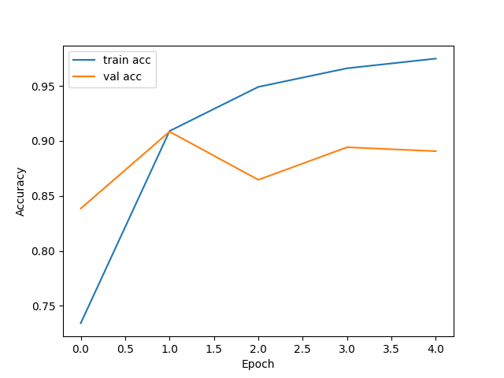
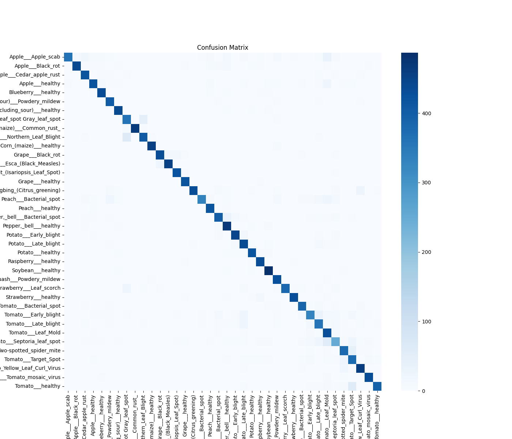

# Plant Disease Classification

Deep Learning-based image classification for automated detection of plant diseases.  
_Client work: Dataset preprocessing, model training, evaluation, and visualizations included._

---
## Highlights

- **Dataset:** PlantVillage (38 classes – healthy + diseased leaves)  
- **Visualizations:** Training progress, confusion matrix, and sample images  
- **Lightweight:** Uses a subset of the dataset for quick experiments  
- **Ready for deployment:** Can be further fine-tuned or deployed as-is  

## Sample Visualizations

### Training Accuracy & Loss

### Confusion Matrix

